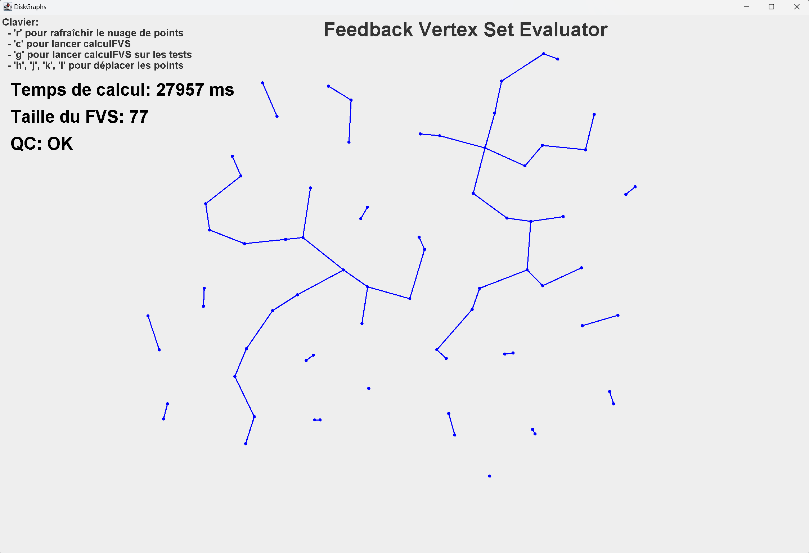

# Feedback Vertex Set Solver (FVS)

---

**Note**: Ce projet s'inscrit dans le cadre de la recherche en théorie des graphes et optimisation algorithmique.

## Description Détaillée

Le Feedback Vertex Set est un projet de résolution de problème NP-difficile dans la théorie des graphes. Il vise à trouver le plus petit ensemble de sommets qui, une fois retirés, rendent le graphe acyclique.

## Images & Résultats

### Graphe Initial (FVS_8204.png)


_Représentation initiale du graphe géométrique montrant des cycles et connexions complexes._

### État Optimisé (FVS77_QC-ok_Time-27s.png)


_Résultat après optimisation :_

- Temps d'exécution : 27957 ms
- Taille FVS : 77 sommets
- QC : OK

### Validation Finale (FVS77_QC-ok_Time-37s.png)


_Validation de la solution :_

- Temps d'exécution : 35022 ms
- Taille FVS maintenue à 77
- Qualité validée (QC: OK)

## Prérequis

- Java JDK 8+
- Apache Ant
- IDE Java (VS Code, IntelliJ IDEA recommandés)

## Installation

```bash
git clone https://github.com/ottodpc/Feedback-Vertex-Set.git
cd Feedback-Vertex-Set
ant clean
ant run
```

## Utilisation

### Commandes

- `r` : Rafraîchir les points
- `c` : Calculer FVS
- `g` : Tests FVS
- `h,j,k,l` : Déplacer les points

## Structure du Code

```
src/
├── algorithms/
│   ├── DefaultTeam.java
│   └── Evaluation.java
├── tests/
└── build.xml
```

## Algorithmes

1. **Algorithme Glouton (Greedy)**

   - Construction de solution initiale
   - Sélection basée sur les degrés
   - Complexité : O(V \* (V + E))

2. **Recherche Locale**
   - Optimisation de solution
   - Remplacement 2-pour-1
   - Convergence locale

## Applications Pratiques

### Domaines d'Application

1. **Conception de Circuits**

   - Élimination des boucles de rétroaction
   - Placement optimal des registres

2. **Réseaux Informatiques**

   - Prévention des deadlocks
   - Optimisation du routage

3. **Bioinformatique**
   - Analyse des réseaux génétiques
   - Étude des voies métaboliques

## Performances

- Temps moyen : 27-35 secondes
- Taille FVS : 77 sommets
- Validation : QC OK

## Limites Actuelles

1. **Complexité**

   - Problème NP-difficile
   - Temps exponentiel (pire cas)

2. **Qualité**
   - Optimalité non garantie
   - Dépendance aux instances

## Perspectives

1. **Améliorations**

   - Parallélisation
   - Apprentissage automatique
   - Optimisation multi-objectif

2. **Extensions**
   - Support graphe dynamique
   - Visualisation temps réel

## Tests et Validation

- Tests unitaires inclus
- Validation de solution automatique
- Métriques de performance

## Contribution

1. Forker le projet
2. Créer une branche (`git checkout -b feature/AmazingFeature`)
3. Commit (`git commit -m 'Add AmazingFeature'`)
4. Push (`git push origin feature/AmazingFeature`)
5. Pull Request

## Auteur

OTTO Dieu-Puissant Cyprien

## Licence

MIT License
